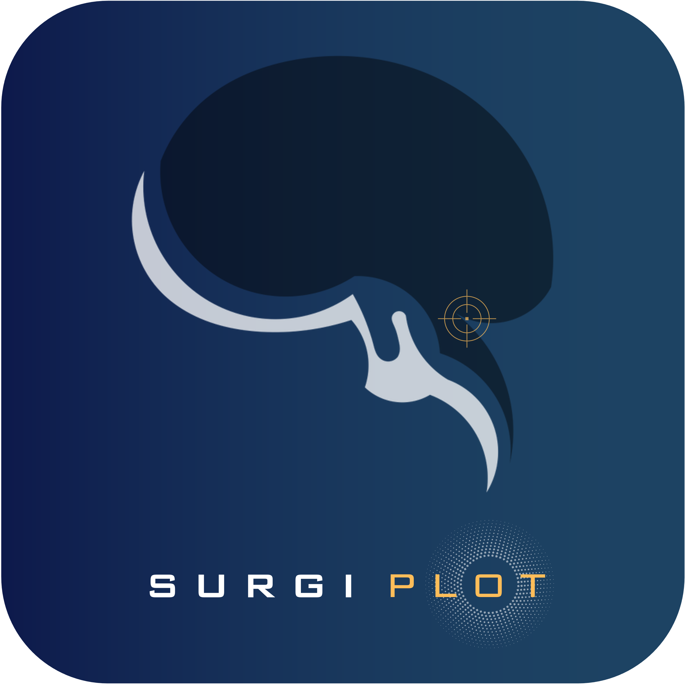

<p align="center">
  
</p>

<p align="center">
  
</p>

# Surgiplot

Surgiplot is a local scientific software environment for quantitative neuroanatomical and skull-base analysis. It provides:

1. a desktop GUI for dataset curation, imported 3D scene landmark acquisition, and interactive visualization
2. a Python library and CLI for reproducible scripting, batch studies, and research pipelines

Its core design principle is simple: once landmarks are represented as explicit 3D coordinates in a common frame, operative metrics should be computed from inspectable geometric constructs rather than opaque software state.

## Scope

Surgiplot currently supports:

- `VoA` — Visuo-operative Angle
- `VOM` — Volume of Operative Maneuverability
- `sVOM` — standardized VOM
- `AoA` — Angle of Attack
- `SF` — Surgical Freedom
- `AoE` — Angle of Exposure
- `3D Distance`
- `3D Area`
- `3D Volume`

The same metric logic can be applied to landmarks originating from:

- neuronavigation exports
- normalized tabular datasets
- generic 3D point files
- manually assembled point sets
- imported 3D scenes curated through the GUI

## Installation

### Core package

```bash
pip install -e .
```

### With 3D scene rendering support

```bash
pip install -e .[scene3d]
```

### Main entry points

```bash
surgiplot
surgiplot version
surgiplot_gui
```

## Conceptual model

Surgiplot uses a single editable `Dataset` object as its canonical data container.

Each dataset stores:

- canonical point identifiers such as `point_1`, `point_2`, ...
- optional semantic labels or aliases such as `apex`, `cranial`, `pivot`, `medial`
- metadata such as acquisition source, vendor, and coordinate system

This allows the same metric function to be called using either canonical point names or human-readable labels.

## Python library

### Minimal example

```python
import surgiplot as sp

ds = sp.load("annotations.csv", source="database")

result = sp.DISTANCE_3D(data=ds, A="point_1", B="point_2")
print(result.distance_mm)
```

### Manual dataset construction

```python
import surgiplot as sp

ds = sp.from_points(
    points=[
        [0.0, 0.0, 0.0],
        [10.0, 0.0, 0.0],
        [0.0, 10.0, 0.0],
        [0.0, 0.0, 10.0],
    ],
    names=["cranial", "caudal", "medial", "pivot"],
    source="research",
)
```

### Relabeling and canonical point management

```python
import surgiplot as sp

ds = sp.load("navigation_export.txt", source="navigation")

sp.apply_labels(
    ds,
    {
        "point_1": ["cranial"],
        "point_2": ["caudal"],
        "point_3": ["medial"],
        "point_4": ["lateral"],
        "point_5": ["pivot"],
    },
)

sp.rename_points(ds, {"point_120": "entry_anchor"})
```

### Research-facing convenience API

The full metric kernels remain available:

```python
sp.VOM_VOA(...)
sp.AOA_SF(...)
sp.AOE(...)
sp.DISTANCE_3D(...)
sp.AREA_3D(...)
sp.VOLUME_3D(...)
```

For script ergonomics, Surgiplot also exposes convenience wrappers:

```python
sp.VOM(...)
sp.VOA(...)
sp.SVOM(...)
sp.AOA(...)
sp.SF(...)
```

These wrappers do not change the underlying computation. They simply extract the relevant quantity from the established result objects.

### Example: VOM / VoA workflow

```python
import surgiplot as sp

ds = sp.load("case_07.csv", source="database")

result = sp.VOM_VOA(
    data=ds,
    entry=["entry_a", "entry_b", "entry_c", "entry_d"],
    target=["target_a", "target_b", "target_c", "target_d"],
    stand_dist=10.0,
    return_debug=True,
)

print(result.voa_deg)
print(result.vom_mm3)
print(result.svom_mm3)
```

### Example: AoA / SF workflow

```python
import surgiplot as sp

ds = sp.load("case_07.csv", source="database")

result = sp.AOA_SF(
    data=ds,
    entry=["cranial", "caudal", "medial", "lateral"],
    target="pivot",
    sf_rescale_radius_mm=10.0,
    return_debug=True,
)

print(result.aoa_vertical_deg)
print(result.aoa_horizontal_deg)
print(result.sf_entry_area_mm2)
print(result.sf_entry_area_rescaled_mm2)
```

## CLI guide

The CLI is designed for stateless research workflows: load a dataset or annotation file, optionally normalize/relabel it, and emit structured results.

## CLI overview

```bash
surgiplot version
surgiplot dataset summary FILE
surgiplot dataset labels FILE [--label ...] [--rename ...] [--out ...]
surgiplot dataset export FILE OUT
surgiplot metric vom-voa ...
surgiplot metric vom ...
surgiplot metric voa ...
surgiplot metric svom ...
surgiplot metric aoa-sf ...
surgiplot metric aoa ...
surgiplot metric sf ...
surgiplot metric aoe ...
surgiplot metric distance ...
surgiplot metric area ...
surgiplot metric volume ...
```

### Dataset inspection

```bash
surgiplot dataset summary case_01.csv --source database
```

### Relabeling for downstream scripts

```bash
surgiplot dataset labels case_01.csv \
  --label point_1=cranial \
  --label point_2=caudal \
  --label point_3=medial \
  --label point_4=lateral \
  --label point_5=pivot \
  --out case_01_labeled.json
```

### Renaming canonical points

```bash
surgiplot dataset labels case_01.csv \
  --rename point_120=entry_anchor \
  --rename point_121=target_anchor \
  --out case_01_renamed.json
```

### Export to normalized JSON

```bash
surgiplot dataset export raw_navigation.txt normalized_case.json --source navigation
```

### VOM / VoA from the terminal

```bash
surgiplot metric vom-voa case_01_labeled.json \
  --entry cranial,caudal,medial,lateral \
  --target target_a,target_b,target_c,target_d \
  --stand-dist 10.0
```

### AoA only

```bash
surgiplot metric aoa case_01_labeled.json \
  --cranial cranial \
  --caudal caudal \
  --medial medial \
  --lateral lateral \
  --pivot pivot \
  --sf-rescale-radius-mm 10.0
```

### SF only

```bash
surgiplot metric sf case_01_labeled.json \
  --cranial cranial \
  --caudal caudal \
  --medial medial \
  --lateral lateral \
  --pivot pivot
```

### Area, distance, and volume

```bash
surgiplot metric distance case_01_labeled.json --A point_1 --B point_2
surgiplot metric area case_01_labeled.json --polygon point_1,point_2,point_3,point_4
surgiplot metric volume case_01_labeled.json --points point_1,point_2,point_3,point_4,point_5,point_6
```

CLI outputs are emitted as structured JSON-like text, making them easy to capture in shell pipelines, notebooks, Snakemake rules, or institutional batch-processing environments.

## Supported inputs

### Navigation imports

- Stryker annotation exports
- Medtronic JSON annotation exports
- generic navigation-like point lists

### Tabular / normalized inputs

- `.csv`
- `.tsv`
- `.xlsx`
- `.xls`

Required normalized columns:

- `name`
- `x`
- `y`
- `z`

### Generic point text

Accepted line formats include:

```text
point_1, 1.0, 2.0, 3.0
point_2 4.0 5.0 6.0
point_3\t7.0\t8.0\t9.0
```

## GUI workflow

The GUI remains the preferred environment for:

- point curation and label editing
- imported 3D scene scaling
- direct point collection on an anatomical scene
- interactive geometric inspection of metric constructs

Launch with:

```bash
surgiplot_gui
```

## Package layout

```text
surgiplot/
  core/
    dataset.py
    io/
    geometry/
    transforms/
  metrics/
    aoa_sf.py
    aoe.py
    vom_voa.py
    distance_3d.py
    area_3d.py
    volume_3d.py
  cli/
    app.py
  gui/
    app.py
  ai/
    scene_reconstruction.py
    scene_picker.py
```

## Reproducibility notes

For research use, the recommended pattern is:

1. preserve the original export file
2. normalize to a Surgiplot dataset
3. record label mappings explicitly
4. run metrics from a script or CLI command
5. save metric outputs together with dataset version and package version

You can retrieve the installed package version with:

```bash
surgiplot version
```

or in Python:

```python
import surgiplot as sp
print(sp.__version__)
```

## Current design boundaries

Surgiplot is intentionally oriented around explicit coordinate-based geometry. It is not a general-purpose mesh editing system, and it does not attempt to replace specialized surgical planning or scientific visualization platforms.

For large-scale interactive 3D scene handling, the GUI is best regarded as a landmark acquisition and metric-integration environment rather than a full native mesh workstation.

## Citation-style description

If you need a concise methodological description for internal notes or manuscript methods sections:

> Surgiplot is a local coordinate-based analysis environment for neurosurgical anatomical research. It normalizes heterogeneous 3D landmark sources into a common dataset abstraction and computes explicit geometric metrics including AoA, SF, VoA, VOM, sVOM, AoE, linear distance, polygonal area, and sparse point-derived volume.
